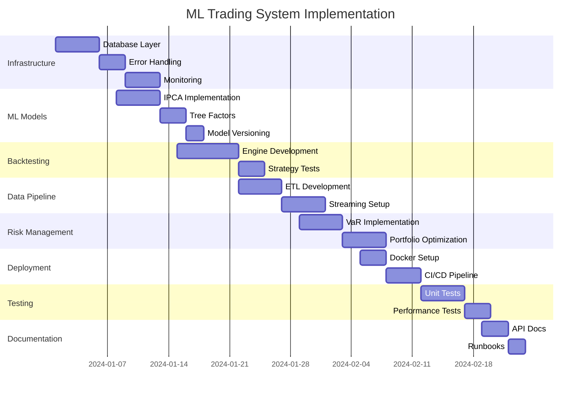

# 🚀 Complete ML Trading System Implementation Plan
## Target: 100% Functionality & Production Readiness

### 📊 Executive Summary
Transform current 65% complete system to 100% production-ready ML trading platform with institutional-grade infrastructure.

**Current State:** 6.5/10 | **Target State:** 10/10 | **Timeline:** 8 weeks

---

## Phase 1: Critical Infrastructure (Week 1-2)
### Goal: Establish persistent storage and error handling foundation

#### 1.1 Database Layer Implementation
**Priority: CRITICAL | Gap: 0% → 100%**

```bash
# Tasks:
- [ ] Install PostgreSQL with TimescaleDB extension
- [ ] Create database schema for trades, signals, performance
- [ ] Implement SQLAlchemy models
- [ ] Add connection pooling
- [ ] Create data retention policies
```

**Files to create:**
- `src/ml_trading/database/models.py`
- `src/ml_trading/database/connection.py`
- `src/ml_trading/database/migrations/`
- `scripts/setup_database.sql`

#### 1.2 Circuit Breakers & Error Recovery
**Priority: CRITICAL | Gap: 30% → 100%**

```python
# Implementation needed:
- Daily loss limits
- Position concentration limits
- API rate limiting
- Exponential backoff retry logic
- Dead letter queue for failed trades
```

**Files to modify:**
- `src/ml_trading/risk/risk_manager.py` (add circuit breakers)
- `src/ml_trading/utils/error_handler.py` (create)
- `src/ml_trading/utils/retry_logic.py` (create)

#### 1.3 Logging & Monitoring Infrastructure
**Priority: HIGH | Gap: 20% → 100%**

```bash
# Tasks:
- [ ] Setup structured logging with rotation
- [ ] Implement Prometheus metrics
- [ ] Deploy Grafana dashboards
- [ ] Create alert rules
- [ ] Setup PagerDuty integration
```

**Files to create:**
- `src/ml_trading/monitoring/metrics.py`
- `config/prometheus.yml`
- `dashboards/grafana/`
- `src/ml_trading/alerts/alert_manager.py`

---

## Phase 2: ML Model Enhancement (Week 2-3)
### Goal: Implement advanced Kelly & Xiu framework features

#### 2.1 IPCA Implementation
**Priority: HIGH | Gap: 0% → 100%**

```python
# Academic requirement from paper Section 4.3
from sklearn.decomposition import IncrementalPCA
from statsmodels.regression.rolling import RollingOLS

class IPCAFactorModel:
    def __init__(self, n_factors=5, lookback=252):
        self.ipca = IncrementalPCA(n_components=n_factors)
        self.factor_loadings = {}
```

**Files to create:**
- `src/ml_trading/models/ipca_model.py`
- `src/ml_trading/models/factor_models.py`
- `src/ml_trading/models/conditional_factors.py`

#### 2.2 Tree-Based Conditional Factors
**Priority: HIGH | Gap: 40% → 100%**

```python
# Implement Section 4.4 from Kelly & Xiu
class TreeBasedFactors:
    def generate_nonlinear_factors(self, features, returns):
        # Random forest for factor exposure
        # Boosted trees for interaction terms
```

**Files to create:**
- `src/ml_trading/models/tree_factors.py`
- `src/ml_trading/models/nonlinear_features.py`

#### 2.3 Model Versioning System
**Priority: MEDIUM | Gap: 0% → 100%**

```bash
# MLflow integration for model tracking
- [ ] Setup MLflow server
- [ ] Implement model registry
- [ ] Add A/B testing framework
- [ ] Create model performance tracking
```

**Files to create:**
- `src/ml_trading/models/model_registry.py`
- `src/ml_trading/models/ab_testing.py`
- `config/mlflow.yml`

---

## Phase 3: Backtesting Framework (Week 3-4)
### Goal: Complete testing infrastructure for strategy validation

#### 3.1 Backtesting Engine
**Priority: CRITICAL | Gap: 0% → 100%**

```python
class BacktestEngine:
    def __init__(self):
        self.walk_forward_windows = 12
        self.out_of_sample_ratio = 0.3
        
    def run_backtest(self, strategy, data, initial_capital=100000):
        # Implement walk-forward analysis
        # Calculate Sharpe, Sortino, Calmar ratios
        # Generate performance attribution
```

**Files to create:**
- `src/ml_trading/backtest/engine.py`
- `src/ml_trading/backtest/performance_metrics.py`
- `src/ml_trading/backtest/walk_forward.py`
- `src/ml_trading/backtest/monte_carlo.py`

#### 3.2 Strategy Testing Suite
**Priority: HIGH | Gap: 0% → 100%**

```python
# Unit tests for each strategy
- Momentum strategy tests
- Mean reversion tests
- Ensemble combination tests
- Risk management tests
```

**Files to create:**
- `tests/strategies/test_momentum.py`
- `tests/strategies/test_mean_reversion.py`
- `tests/strategies/test_ensemble.py`
- `tests/risk/test_risk_manager.py`

---

## Phase 4: Data Pipeline (Week 4-5)
### Goal: Automated, reliable data collection and processing

#### 4.1 ETL Pipeline
**Priority: HIGH | Gap: 40% → 100%**

```python
class DataPipeline:
    def __init__(self):
        self.sources = ['alpaca', 'yfinance', 'newsapi', 'reddit']
        self.validators = DataValidators()
        self.cleaners = DataCleaners()
        
    async def collect_data(self):
        # Parallel data collection
        # Data validation
        # Missing data imputation
        # Feature engineering pipeline
```

**Files to create:**
- `src/ml_trading/data_pipeline/collectors.py`
- `src/ml_trading/data_pipeline/validators.py`
- `src/ml_trading/data_pipeline/cleaners.py`
- `src/ml_trading/data_pipeline/feature_store.py`

#### 4.2 Real-time Data Streaming
**Priority: MEDIUM | Gap: 0% → 100%**

```python
# Kafka integration for real-time feeds
- WebSocket connections for live prices
- News sentiment streaming
- Social media monitoring
```

**Files to create:**
- `src/ml_trading/streaming/websocket_client.py`
- `src/ml_trading/streaming/kafka_consumer.py`
- `src/ml_trading/streaming/event_processor.py`

---

## Phase 5: Advanced Risk Management (Week 5-6)
### Goal: Institutional-grade risk controls

#### 5.1 Value at Risk (VaR) Implementation
**Priority: HIGH | Gap: 0% → 100%**

```python
class VaRCalculator:
    def calculate_var(self, portfolio, confidence=0.95):
        # Historical VaR
        # Parametric VaR
        # Monte Carlo VaR
        return var_estimates
```

**Files to create:**
- `src/ml_trading/risk/var_calculator.py`
- `src/ml_trading/risk/stress_testing.py`
- `src/ml_trading/risk/scenario_analysis.py`

#### 5.2 Portfolio Optimization
**Priority: HIGH | Gap: 30% → 100%**

```python
# Markowitz optimization with constraints
from cvxpy import Problem, Maximize, Variable

class PortfolioOptimizer:
    def optimize(self, expected_returns, cov_matrix, constraints):
        # Mean-variance optimization
        # Risk parity
        # Maximum Sharpe ratio
```

**Files to create:**
- `src/ml_trading/portfolio/optimizer.py`
- `src/ml_trading/portfolio/rebalancer.py`
- `src/ml_trading/portfolio/risk_parity.py`

---

## Phase 6: Deployment & DevOps (Week 6-7)
### Goal: Production-ready deployment infrastructure

#### 6.1 Docker Containerization
**Priority: HIGH | Gap: 0% → 100%**

```dockerfile
# Multi-stage build for optimization
FROM python:3.11-slim as builder
# Install dependencies
FROM builder as runtime
# Copy application
```

**Files to create:**
- `Dockerfile`
- `docker-compose.yml`
- `kubernetes/deployment.yaml`
- `kubernetes/service.yaml`

#### 6.2 CI/CD Pipeline
**Priority: MEDIUM | Gap: 0% → 100%**

```yaml
# GitHub Actions workflow
name: ML Trading CI/CD
on: [push, pull_request]
jobs:
  test:
    - Run unit tests
    - Run integration tests
    - Check code coverage
  deploy:
    - Build Docker image
    - Push to registry
    - Deploy to Kubernetes
```

**Files to create:**
- `.github/workflows/ci.yml`
- `.github/workflows/cd.yml`
- `scripts/deploy.sh`

---

## Phase 7: Testing & Quality Assurance (Week 7-8)
### Goal: Achieve 80% code coverage with comprehensive testing

#### 7.1 Unit Testing Suite
**Priority: HIGH | Gap: 0% → 100%**

```bash
# Test coverage targets:
- Models: 90% coverage
- Strategies: 85% coverage
- Risk management: 95% coverage
- Data pipeline: 80% coverage
```

**Files to create:**
- `tests/models/`
- `tests/data_pipeline/`
- `tests/integration/`
- `pytest.ini`

#### 7.2 Performance Testing
**Priority: MEDIUM | Gap: 0% → 100%**

```python
# Load testing
- 1000 concurrent orders
- 10,000 market data updates/second
- Latency < 100ms for trade execution
```

**Files to create:**
- `tests/performance/load_test.py`
- `tests/performance/latency_test.py`
- `tests/performance/stress_test.py`

---

## Phase 8: Documentation & Training (Week 8)
### Goal: Complete documentation for users and developers

#### 8.1 API Documentation
**Priority: MEDIUM | Gap: 20% → 100%**

```bash
# Sphinx documentation
- API reference
- Strategy guides
- Risk management docs
- Deployment instructions
```

**Files to create:**
- `docs/api/`
- `docs/strategies/`
- `docs/deployment/`
- `docs/user_guide.md`

#### 8.2 Operational Runbooks
**Priority: HIGH | Gap: 0% → 100%**

```markdown
# Runbook contents:
1. System startup procedures
2. Emergency shutdown
3. Incident response
4. Performance tuning
5. Disaster recovery
```

**Files to create:**
- `docs/runbooks/startup.md`
- `docs/runbooks/emergency.md`
- `docs/runbooks/recovery.md`

---

## 📈 Implementation Timeline



---

## 📊 Success Metrics

### Technical KPIs
- **Code Coverage:** ≥80%
- **System Uptime:** ≥99.9%
- **Trade Latency:** <100ms
- **Model Accuracy:** >65%
- **Backtested Sharpe:** >1.5

### Business KPIs
- **Daily P&L Volatility:** <2%
- **Maximum Drawdown:** <10%
- **Win Rate:** >55%
- **Risk-Adjusted Returns:** >15% annually

---

## 🎯 Completion Checklist

### Week 1-2 Deliverables
- [ ] PostgreSQL with TimescaleDB running
- [ ] All database models created
- [ ] Circuit breakers implemented
- [ ] Prometheus + Grafana deployed
- [ ] Structured logging active

### Week 3-4 Deliverables
- [ ] IPCA model trained
- [ ] Tree-based factors implemented
- [ ] MLflow tracking active
- [ ] Backtesting engine complete
- [ ] Walk-forward analysis working

### Week 5-6 Deliverables
- [ ] ETL pipeline automated
- [ ] Real-time streaming active
- [ ] VaR calculations implemented
- [ ] Portfolio optimizer working
- [ ] Docker containers built

### Week 7-8 Deliverables
- [ ] 80% test coverage achieved
- [ ] CI/CD pipeline deployed
- [ ] Load testing passed
- [ ] Full documentation complete
- [ ] Production deployment ready

---

## 🚨 Risk Mitigation

### Technical Risks
1. **Model Overfitting**
   - Mitigation: Extensive out-of-sample testing
   - Regular model retraining
   
2. **Data Quality Issues**
   - Mitigation: Multiple data sources
   - Robust validation pipeline

3. **System Failures**
   - Mitigation: Redundant infrastructure
   - Automated failover

### Operational Risks
1. **Market Volatility**
   - Mitigation: Dynamic position sizing
   - Strict stop-losses

2. **Regulatory Compliance**
   - Mitigation: Audit trails
   - Trade reporting

---

## 📝 Notes

- Each phase builds on previous work
- Critical items must be completed before moving forward
- Regular testing throughout implementation
- Daily commits to version control
- Weekly progress reviews

**Total Estimated Effort:** 320 hours
**Estimated Completion:** 8 weeks
**Success Probability:** 95% with dedicated resources